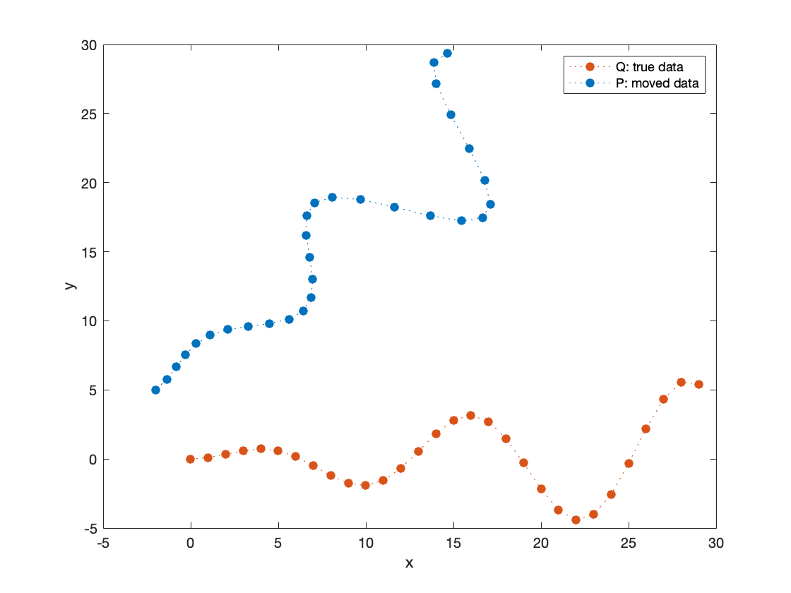
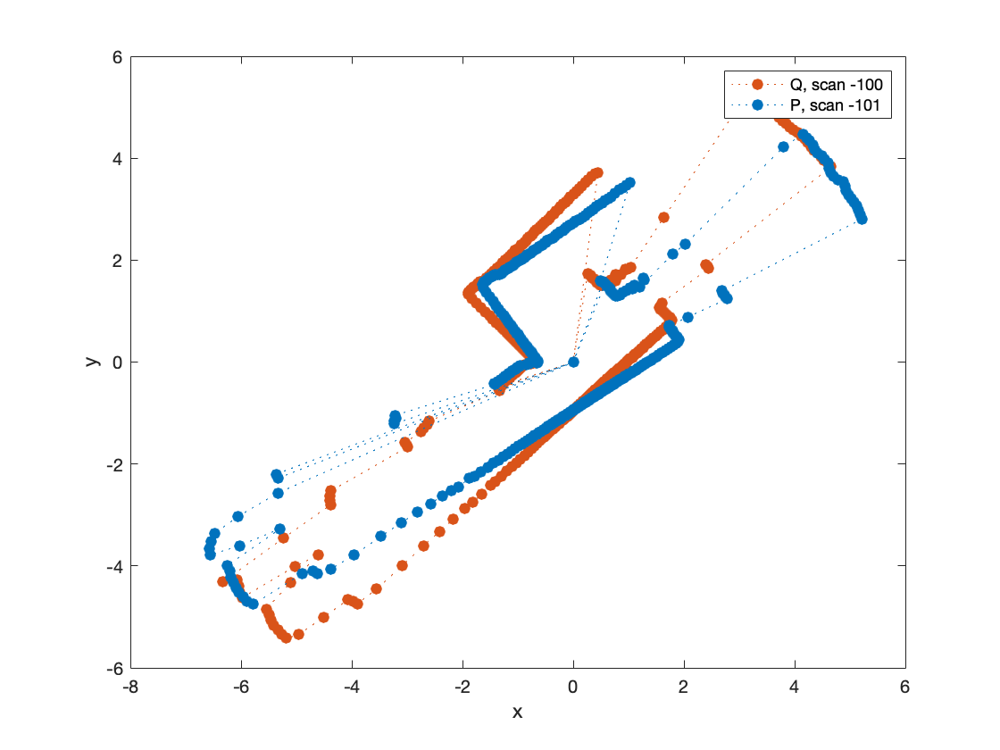
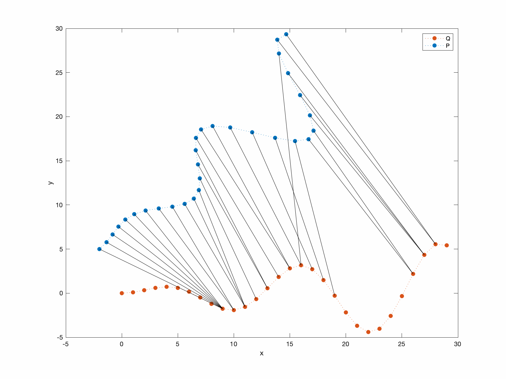
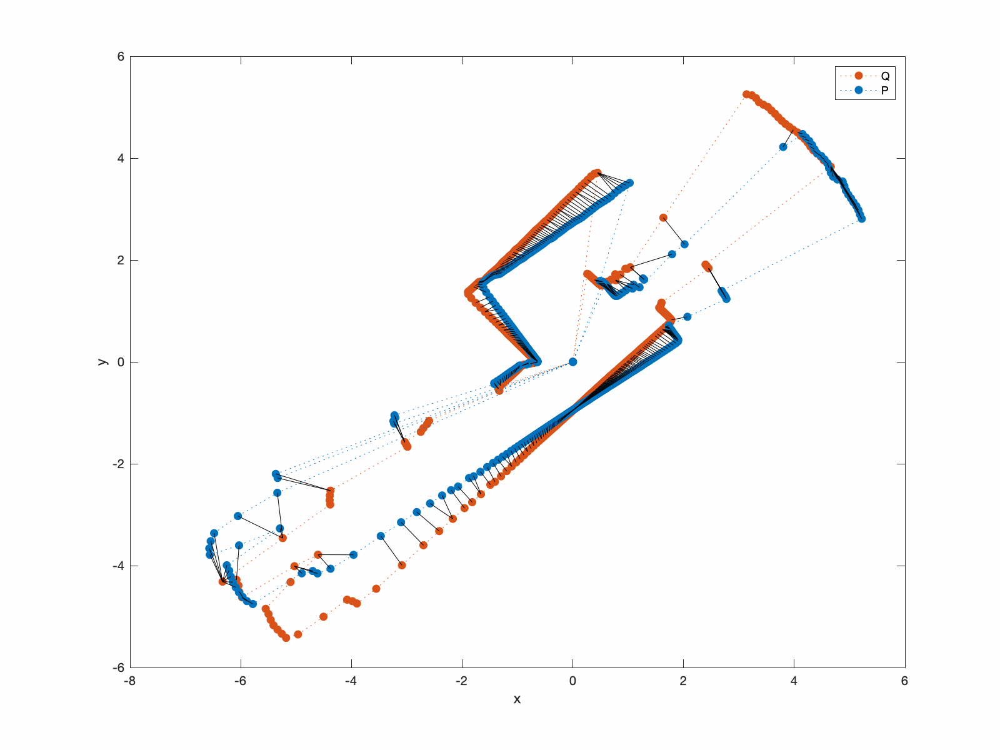
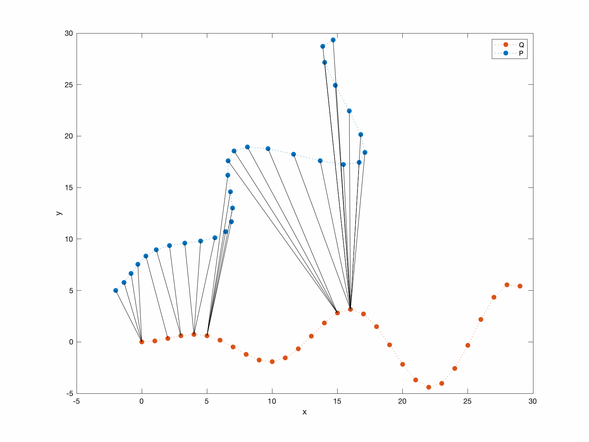

# ICP
**Iterative closest point (ICP) for 2D laser scan matching.** 
This repo is a Matlab version of the Python notebook: https://nbviewer.org/github/niosus/notebooks/blob/master/icp.ipynb .
In addition, demos using real-world RP Lidar measurements are included. 

## Contents:
- **Data generation/loading**
- **ICP using Singular Value Decomposition (SVD)**
- **ICP using Least Squares (point-to-point correspondences)**
- **ICP using Least Squares (point-to-plane correspondences)**

## **Data generation/loading**
For sample data, you can either simulate data points or load real-world 2D Lidar data collected using RP-LIDAR. 
```
demo_data_simulation.m 
demo_lidar_scans.m
```
<p float="left">
 
 
</p>

## **ICP - singular value decomposition (SVD)** 
```
demo_ICP_SVD.m
```
<p float="left">
 
 
</p>

## **ICP - least squares (point-to-point)** 
```
demo_lCP_LS.m
```
<p float="left">
 
 
</p>


## **ICP - least squares (point-to-plane)** 
``` 
demo_ICP_LS_normal.m
```
<p float="left">
 
 
</p>
